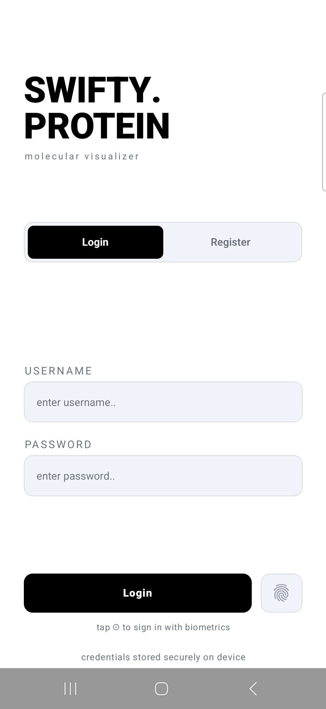

# Swifty Proteins

A 3D protein ligand visualizer built with React Native (Expo). Fetches molecular data from the RCSB Protein Data Bank and renders interactive 3D ball-and-stick models.

---

## App Preview

### Sign-in Screen


### App Showcase
<video src="assets/swifty-proteins-appshowcase.mp4" controls width="100%"></video>

---

## Try It on Android

An Android APK is included for direct installation:

**[Download APK → assets/Swifty-proteins.apk](assets/Swifty-proteins.apk)**

Transfer it to your Android device, enable *Install from unknown sources* in settings, and install it directly — no build step needed.

---

## Run from Source

**Requirements:** Node.js installed on your machine.

```bash
npm install
npm run start
```

This launches the Expo dev server. Scan the QR code with the **Expo Go** app (iOS or Android) or press `a` to open on a connected Android device/emulator.

---

## Project Requirements

> The following is a summary of what this project was built to achieve (42 school subject).

### Overview

Swifty Proteins is a mobile application that lets users browse and visualize 3D structures of protein ligands from the RCSB Protein Data Bank. It combines bioinformatics, 3D graphics rendering, biometric authentication, and network programming into a single cohesive app.

---

### Mandatory Features

#### 1. Application Icon & Launch Screen
- Custom icon aligned with a molecular/scientific theme
- A branded splash screen displayed for 1–2 seconds on launch

#### 2. Login View
- User account creation with username and password (minimum security requirements enforced)
- **Biometric authentication**: Face ID / Touch ID (iOS) or BiometricPrompt (Android)
- Fallback to username/password if the device doesn't support biometrics
- The login screen is **always shown** when the app launches or returns from background — even if the user was previously authenticated
- Passwords are never stored in plain text (hashed with a secure algorithm)

#### 3. Protein List View
- Displays all ligands from a bundled `ligands.txt` file in a scrollable list
- Real-time search bar — filters as you type, case-insensitive
- Tapping a ligand fetches its `.cif` file from RCSB:
  ```
  https://files.rcsb.org/ligands/view/{ligand}.cif
  ```
- Loading indicator shown during fetch and parsing
- Graceful error handling: network errors, 404s, parse failures, and timeouts all show a user-friendly alert

#### 4. Protein View (3D Visualization)
- **Ball-and-Stick model**: atoms as spheres, bonds as cylinders
- **CPK coloring scheme**:

  | Element | Color |
  |---------|-------|
  | Carbon (C) | Black / Gray |
  | Hydrogen (H) | White |
  | Oxygen (O) | Red |
  | Nitrogen (N) | Blue |
  | Sulfur (S) | Yellow |
  | Phosphorus (P) | Orange |
  | Other | Standard CPK |

- **Tap an atom** → shows a tooltip/popup with the element symbol (and optionally coordinates)
- **Gesture controls**: rotate (drag), zoom (pinch), pan (two-finger drag)
- **Share button**: captures a screenshot and opens the native share sheet
- Smooth camera and lighting setup — molecule fully visible on load, 60 FPS target

---

### Bonus Features (implemented on top of the mandatory part)

| Category | Features |
|----------|----------|
| **Multiple Visualization Models** | Space-filling (CPK), Wireframe, Stick — switchable in real-time |
| **Advanced UI** | Custom list cells, smooth animations, dark mode, onboarding, settings screen |
| **Enhanced Interactions** | Atom highlighting by element, bond information, measurement tools, atom labels, center-on-atom |
| **Performance & Caching** | Offline caching of `.cif` files, lazy loading, background parsing, memory management |
| **Sharing & Export** | Custom share messages, multiple export formats, video recording of rotating molecule, favorites list, side-by-side comparison view |

---

### Technical Constraints (from subject)

- Built with the **latest SDK/framework versions** available at evaluation time
- Uses the `.cif` format (RCSB standard since 2014) — not the deprecated `.pdb` format
- All network operations run **asynchronously** — UI never blocks
- **No plain-text password storage** — platform-secure storage only
- Responsive layout adapts to phones, tablets, portrait and landscape
- The app must never crash, freeze, or display unhandled errors during evaluation
- Full game engines (Unity, Unreal) are not permitted — 3D rendering must be integrated into a standard mobile app

---

## Data Source

Ligand structures are fetched live from the **RCSB Protein Data Bank**:
- Website: [https://www.rcsb.org](https://www.rcsb.org)
- Ligand endpoint: `https://files.rcsb.org/ligands/view/{ligand}.cif`
